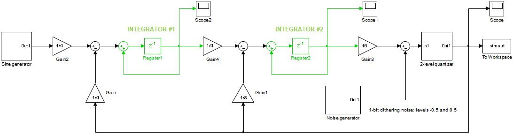

# A second-order sigma-delta DAC with single-bit quantizer

## Functional verification
This benchmark has a functional verification testbench. It generates a sine wave of approximately 1kHz (amplitude = 10000/32767 or approximately -10.3 dB) and feeds this into the SDDAC. The output waveform is analysed by a Python 3 script and shows the output spectrum of the SDDAC (FFT with a Blackman window).

To run the function verification testbench, execute `./run_sddac_tb.sh`. Prerequisites are Python3, Numpy and Matplotlib.
